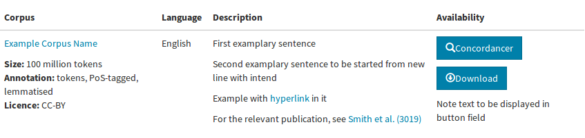

ClarTable
=========

Installation
------------
Works with Python 3.5, 3.6, 3.7
Depending on your default python version:
```bash
pip install -r requirements.txt
```
or
```bash
pip3 install -r requirements.txt
```

About
-----
*ClarTable* is a python script for generating html table containing data about corpora from .csv file.


### Usage
```bash
usage: run.py [-h] [-i PATH] [-r PATH] [-o PATH]

Create html table from given data and rules

optional arguments:
  -h, --help  show this help message and exit
  -i PATH     path to input csv file
  -r PATH     path to json file with rules
  -o PATH     path to file where output html table will be written
```

### CSV format
In order to create html table from .csv file with default rules, the file requires following columns (order not important):

Corpus | Corpus_URL | Language | Size | Annotation | Licence | Description | Buttons | Buttons_URL | Publication | Publication_URL | Note
-------|------------|----------|------|------------|---------|-------------|---------|-------------|-------------|-----------------|-------
Example Corpus Name | www.examplaryurl.com | English | 100 million tokens | tokenised, PoS-tagged, lemmatised | CC-BY | First examplary sentence#SEPSecond examplary sentence to be started from new line with intend#SEPExample with ```<a href="http://some.url">hyperlink</a>``` in it | Concordancer#SEPDownload | https://www.concordancer.com/#SEPhttps://www.download.com | Smith et al. (3019) | https://publication.url | Note text to be displayed in button field

Resulting table:



### Rules format
Rules are composed of nested json notation of tags and field. 
Given rule:
```javascript
{"tags": [
	{"tag": "<table class=\"table\" cellspacing=\"2\">", "tags": [
		{"tag": "<thead>", "tags": [
			{"tag": "<tr>", "tags": [
				{"tag": "<th>", "text": "Corpus name"}
			]}	
		]},
		{"tag": "<tbody>", "tags": [
			{"tag": "<tr>", "tags": [
				{"tag": "<td valign=\"top\"", "tags": [
					{"tag": "<p>", "text": "Some text here", "fields": [
						{"text": "<strong>Field data</strong> will be inserted here: %s", "columns": ['column_name_in_csv_file']}
					]}
				]}
			]}
		]}
	]}
]}
```

Generated html table with names of corpora, assuming there were only 2 rows in a .csv file
```html
<table class ="table" cellspacing="2">
        <thead>
                <tr>
                        <th valign="top">Corpus name
                        </th>
                </tr>
        </thead>
        <tbody>
                <tr>
                        <td valign="top">
                                <p>Some text here
                                <strong>Field data</strong> will be inserted here: NKJP 2.1.4
                                </p>
                        </td>
                </tr>
        </tbody>
        <tbody>
                <tr>
                        <td valign="top">
                                <p>Some text here
                                <strong>Field data</strong> will be inserted here: Common Crawl
                                </p>
                        </td>
                </tr>
        </tbody>
</table>

```
<table class ="table" cellspacing="2">
        <thead>
                <tr>
                        <th valign="top">Corpus name
                        </th>
                </tr>
        </thead>
        <tbody>
                <tr>
                        <td valign="top">
                                <p>Some text here
                                <strong>Field data</strong> will be inserted here: NKJP 2.1.4
                                </p>
                        </td>
                </tr>
        </tbody>
        <tbody>
                <tr>
                        <td valign="top">
                                <p>Some text here
                                <strong>Field data</strong> will be inserted here: Common Crawl
                                </p>
                        </td>
                </tr>
        </tbody>
</table>


\<tbody\> tag encloses tags and fields for row creation, only tags nested within \<tbody\> ... \</tbody\> can contain "fields": []

	
