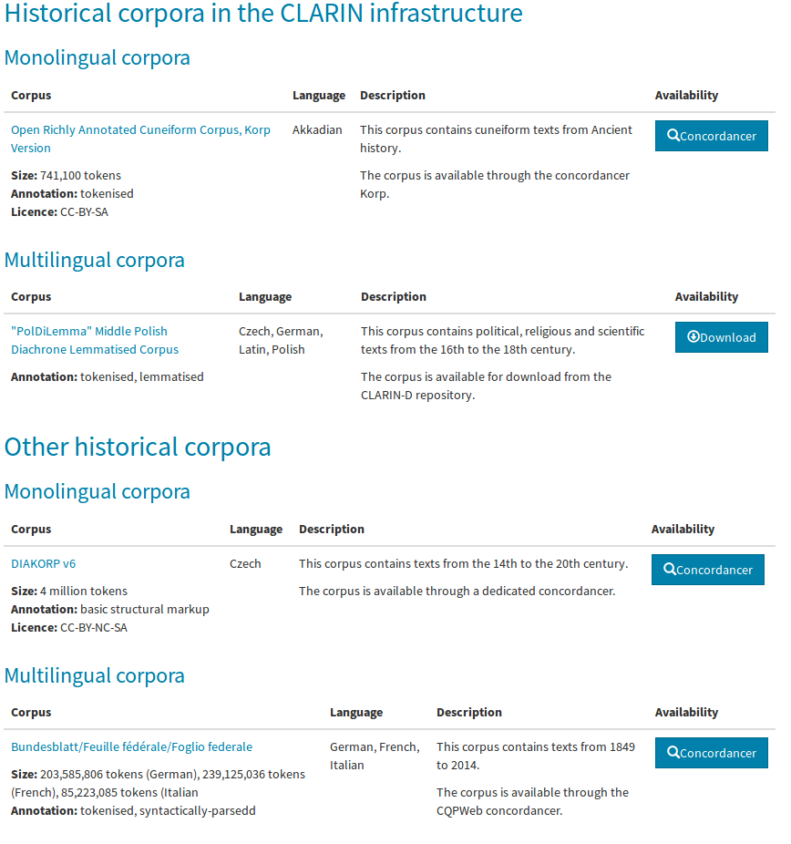

ClarTable
=========

Installation
------------
Works with Python 3.5, 3.6, 3.7
Depending on your default python version:
```bash
pip install -r requirements.txt
```
or
```bash
pip3 install -r requirements.txt
```

About
-----
*ClarTable* is a python script for generating html table containing data about corpora from .csv file.


### Usage

#### Locally:
```bash
usage: run.py [-h] -i PATH -r PATH -o PATH

Create html table from given data and rules

optional arguments:
  -h, --help  show this help message and exit
  -i PATH     path to a .csv file or folder with .csv files
  -r PATH     path to json file with rules
  -o PATH     path to file where output html table will be written
```

#### Via CI:
The html tables for resource families can be generated via GitHub. Push new .csv files to `/resouce_families` and after processing they will appear in gh-pages branch.   

### CSV format
In order to create html table from .csv file with default rules, the file requires __all of following columns__ (order not important). Note that names of columns are case sensitive. If you need generator to consider additional columns contact <michal@clarin.eu> or adjust __rules.json__.

Make sure, that your .csv files __use ; (semicolon)__ as a column separator. 

Single cell may containt multiple paragraphs or structures split with __#SEP__ separator. Following the example below the Description cell consists of 3 paragraphs. Some of the cells depend on others, looking into Buttons cell there are 2 buttons names split with the separator and respective URLs in Buttons_URL.

Corpus | Corpus_URL | Language | Size | Annotation | Licence | Description | Buttons | Buttons_URL | Publication | Publication_URL | Note
-------|------------|----------|------|------------|---------|-------------|---------|-------------|-------------|-----------------|-------
Example Corpus Name | www.examplaryurl.com | English | 100 million tokens | tokenised, PoS-tagged, lemmatised | CC-BY | First examplary sentence #SEPSecond examplary sentence to be started from new line #SEPExample with ```<a href="http://some.url">hyperlink</a>``` in it | Concordancer#SEPDownload | https://www.concordancer.com/ #SEPhttps://www.download.com | Smith et al. (3019) | https://publication.url | Note text to be displayed in button field

Resulting table:


### Table titles and ordering
Table title will be derived from the .csv file name in format X-table_title.csv, where X is index used for table ordering. 
Tables can be grouped into sections by storing them in the intermediate directory within corpora that is subject to the same indexation principle as .csv files.
For example corpora with structure:
```bash
Historical corpora
├── 1-Historical corpora in the CLARIN infrastructure
│   ├── 1-Monolingual corpora.csv
│   └── 2-Multilingual corpora.csv
└── 2-Other historical corpora
    ├── 1-Monolingual corpora.csv
    └── 2-Multilingual corpora.csv
```
Will produce:



### Rules format
Rules are composed of nested json notation of tags and field. 
Given rule:
```javascript
{"tags": [
	{"tag": "<table class=\"table\" cellspacing=\"2\">", "tags": [
		{"tag": "<thead>", "tags": [
			{"tag": "<tr>", "tags": [
				{"tag": "<th>", "text": "Corpus name"}
			]}	
		]},
		{"tag": "<tbody>", "tags": [
			{"tag": "<tr>", "tags": [
				{"tag": "<td valign=\"top\"", "tags": [
					{"tag": "<p>", "fields": [
						{"text": "<strong>Field data</strong> will be inserted here: %s", "columns": ['column_name_in_csv_file']}
					]}
				]}
			]}
		]}
	]}
]}
```

Generated html table with names of corpora, assuming there were only 2 rows in a .csv file
```html
<table class ="table" cellspacing="2">
        <thead>
                <tr>
                        <th valign="top">Corpus name
                        </th>
                </tr>
        </thead>
        <tbody>
                <tr>
                        <td valign="top">
                                <p>
                                <strong>Field data</strong> will be inserted here: NKJP 2.1.4
                                </p>
                        </td>
                </tr>
        </tbody>
        <tbody>
                <tr>
                        <td valign="top">
                                <p>
                                <strong>Field data</strong> will be inserted here: Common Crawl
                                </p>
                        </td>
                </tr>
        </tbody>
</table>

```
<table class ="table" cellspacing="2">
        <thead>
                <tr>
                        <th valign="top">Corpus name
                        </th>
                </tr>
        </thead>
        <tbody>
                <tr>
                        <td valign="top">
                                <p>Some text here
                                <strong>Field data</strong> will be inserted here: NKJP 2.1.4
                                </p>
                        </td>
                </tr>
        </tbody>
        <tbody>
                <tr>
                        <td valign="top">
                                <p>Some text here
                                <strong>Field data</strong> will be inserted here: Common Crawl
                                </p>
                        </td>
                </tr>
        </tbody>
</table>


\<tbody\> tag encloses tags and fields for row creation, only tags nested within \<tbody\> ... \</tbody\> can contain "fields": []

	
